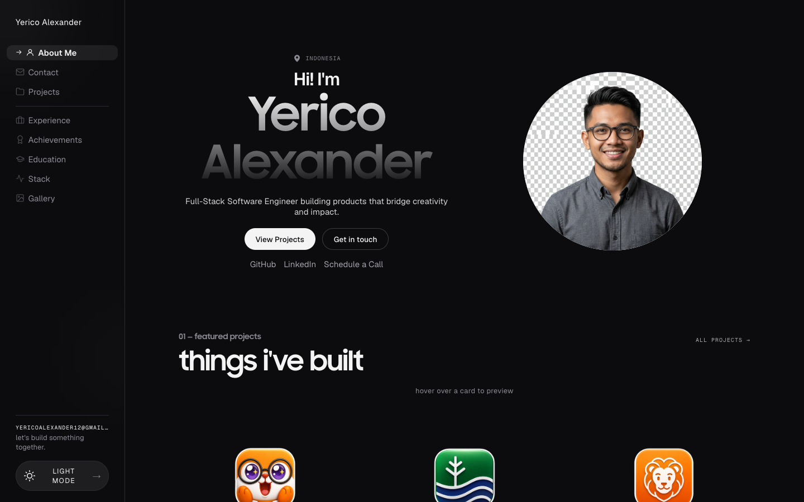
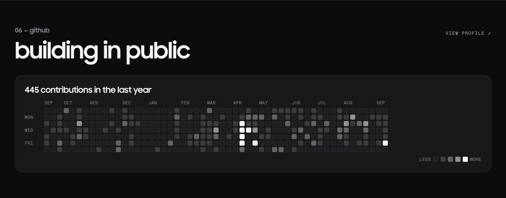
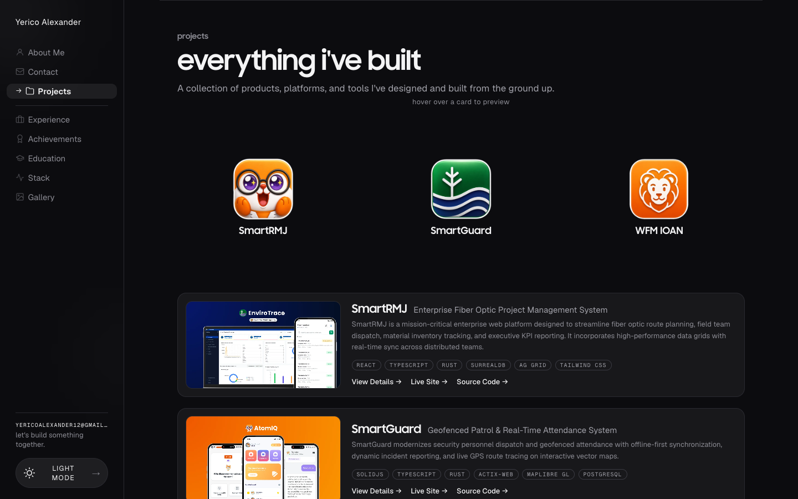
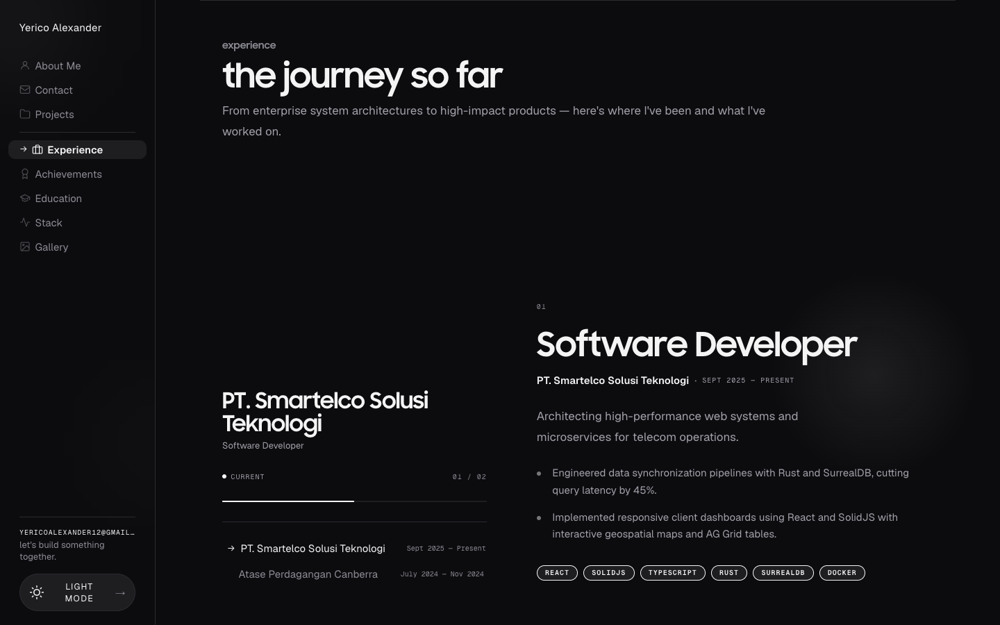
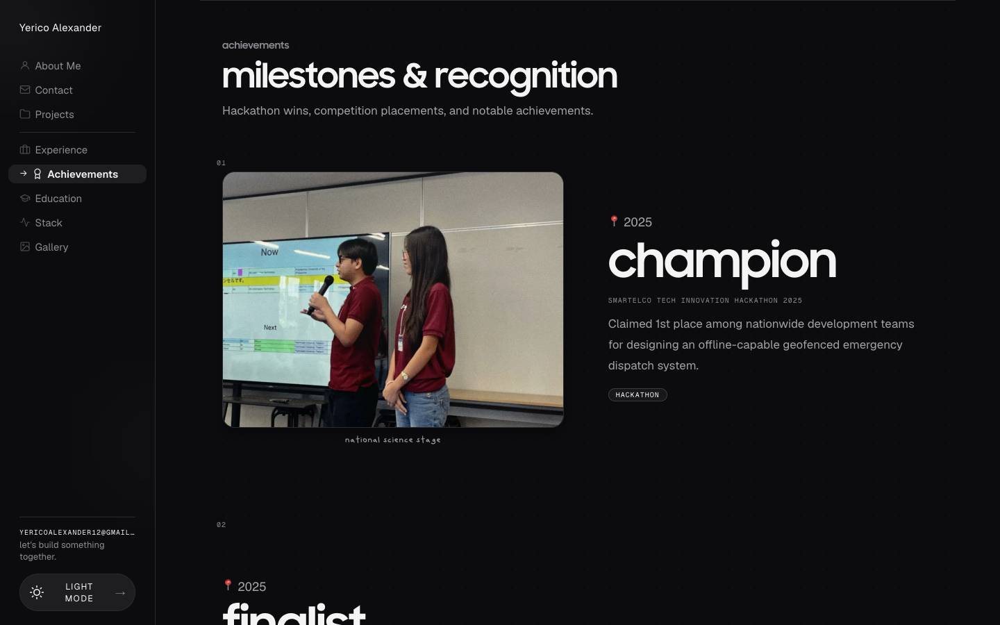
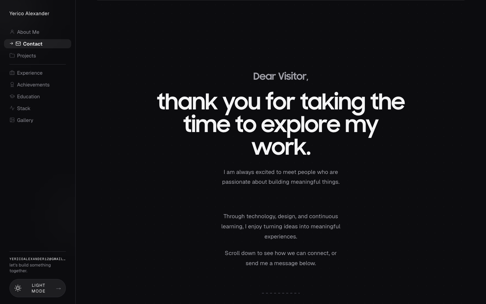

# Yerico Alexander — Personal Portfolio

<div align="center">

[](https://react.dev/)
[](https://vitejs.dev/)
[](https://motion.dev/)
[](https://vercel.com/)

A modern, high-performance developer portfolio website built with **React 19**, **Vite 6**, and **Framer Motion**, engineered to match 1:1 the design aesthetics, fluid animations, and modular architecture of [kentgarcia.me](https://www.kentgarcia.me/).

[Live Demo](https://yerico-portfolio.vercel.app) · [Report Bug](https://github.com/yericoalexander/Portfolio-/issues) · [Request Feature](https://github.com/yericoalexander/Portfolio-/issues)

</div>

---

## 📸 Website Preview

### Hero & Overview


### Real-Time GitHub Contributions Graph
*Automatically fetched live from `api.github.com` with daily commit tooltips and accurate activity distribution:*


### Interactive Projects Archive


### Experience Storyline


### Milestones & Achievements Scrapbook


### Letter Format Contact Page


---

## ✨ Features & Highlights

- ⚡ **1:1 Design Fidelity**: Faithfully reverse-engineered typography (Geist & Samsung Sharp Sans), micro-interactions, layout tokens, and responsive aesthetics.
- 🎯 **Multi-Page SPA Architecture**: Clean client-side routing supporting `/about-me`, `/contact`, `/projects`, `/project/:slug`, `/experience`, `/achievements`, `/education`, `/stack`, and `/gallery` with browser Back/Forward history.
- 📊 **Live GitHub Activity**: Real-time integration pulling dynamic commit counts and heatmap levels directly from GitHub for `@yericoalexander`.
- 🎨 **Adaptive Themes**: Smooth Dark and Light mode toggling with persisted state across reloads.
- 📱 **Fully Responsive**: Flawlessly adapts from ultra-wide displays down to mobile viewports with a fluid slide-out drawer menu.
- 🧩 **Centralized Content Management**: All profile details, project entries, experience items, and skills are decoupled into a single configuration file (`src/data/portfolioData.js`).
- 🚀 **Performance Optimized**: Sub-2s production build with Vite code-splitting chunks and hardware-accelerated 60fps animations.

---

## 🛠️ Tech Stack

- **Core**: [React 19](https://react.dev/) + [Vite 6](https://vitejs.dev/)
- **Animations**: [Framer Motion 12](https://motion.dev/) (Spring physics, layoutId active pills, scroll triggers)
- **Styling**: Vanilla Modern CSS (Tailored Design System tokens, Glassmorphism, CSS Grid)
- **Typography**: Geist, Geist Mono, Plus Jakarta Sans, Samsung Sharp Sans
- **Deployment**: [Vercel](https://vercel.com/) (Configured with SPA rewrites)
- **SEO & Social**: OpenGraph tags, Twitter cards, and Schema.org `Person` JSON-LD

---

## 📂 Project Structure

```
Portfolio/
├── docs/
│   └── screenshots/         # High-resolution website preview captures
├── public/
│   ├── assets/              # Avatar & custom thumbnails
│   ├── fonts/               # Custom webfonts (MyFont.woff2, samsungsharpsans)
│   ├── gallery/             # Moments & memories photos
│   ├── img/
│   │   ├── banners/         # High-res project banners
│   │   └── projects/        # Modal screenshot gallery assets
│   ├── props/               # Interactive device mockups & decorative stickers
│   └── me.webp              # Primary profile portrait
├── src/
│   ├── pages/               # Multi-page standalone view components
│   │   ├── AboutMe.jsx           # /about-me (Main landing)
│   │   ├── Achievements.jsx      # /achievements (Scrapbook + Lightbox)
│   │   ├── Blogs.jsx             # /blogs (Writing & articles)
│   │   ├── Contact.jsx           # /contact (Letter format + SVG flourish)
│   │   ├── Education.jsx         # /education (Campus foundation & leadership)
│   │   ├── Experience.jsx        # /experience (Interactive timeline story)
│   │   ├── Gallery.jsx           # /gallery (Curated photo archive + Modal)
│   │   ├── ProjectDetails.jsx    # /project/:slug (Screenshots & overview)
│   │   ├── Projects.jsx          # /projects (Full archive & filters)
│   │   └── Stack.jsx             # /stack (The Toolbox & exploring tags)
│   ├── components/          # Shared layout & reusable widgets
│   │   ├── FeaturedProjects.jsx  # Interactive mockup preview cards
│   │   ├── Footer.jsx            # Giant thank-you watermark & CTA
│   │   ├── GitHubGraph.jsx       # Real-time contribution heatmap
│   │   ├── Hero.jsx              # Hero greeting & sticker frame
│   │   ├── OverlayMenu.jsx       # Mobile slide-out drawer
│   │   ├── Sidebar.jsx           # Sticky sidebar with layoutId active pill
│   │   └── Topbar.jsx            # Mobile responsive header
│   ├── data/
│   │   └── portfolioData.js # Centralized portfolio data template
│   ├── App.jsx              # Root orchestrator & client-side router
│   ├── index.css            # Production design system stylesheet
│   └── main.jsx             # React entry point
├── index.html               # Semantic HTML5 & JSON-LD Structured Data
├── package.json
├── vercel.json              # Vercel SPA routing configuration
└── vite.config.js           # Rollup code-splitting configuration
```

---

## 🚀 Getting Started

### Prerequisites
- [Node.js](https://nodejs.org/) (v18 or higher recommended)
- [npm](https://www.npmjs.com/) or [pnpm](https://pnpm.io/)

### Installation & Local Setup
```bash
# Clone the repository
git clone https://github.com/yericoalexander/Portfolio-.git

# Enter the project directory
cd Portfolio-

# Install dependencies
npm install

# Start local development server on port 3000
npm run dev
```

Visit **`http://localhost:3000`** in your browser.

---

## ✏️ How to Customize Your Content

All data is decoupled into [`src/data/portfolioData.js`](src/data/portfolioData.js). To customize the website for yourself, simply edit this file:

1. **Personal Information**:
   - `personalInfo`: Update name, role, bio, avatar, email, social profiles, and `githubUsername`.
2. **Projects**:
   - `featuredProjects`: Items displayed on the homepage.
   - `allProjects`: Full project archive including slugs, descriptions, links, and screenshot galleries.
3. **Experience**:
   - `experiences`: Work history, responsibilities, bullet points, and technology badges.
4. **Achievements**:
   - `achievements` & `scrapbookEntries`: Hackathon placements, awards, and associated photos.
5. **Education & Leadership**:
   - `educationList` & `leadershipList`: Academic history and community leadership roles.
6. **Tech Stack**:
   - `techCategories`: Categorized skills (Frontend, Backend, DevOps, Developer Tools) and `currentlyExploring`.
7. **Gallery**:
   - `galleryItems`: Photos, events, tags, and locations.

Asset images can be placed directly in the `public/` directory (`public/img/banners/`, `public/img/projects/`, `public/gallery/`).

---

## 🚢 Deployment to Vercel

The repository includes a ready-to-use [`vercel.json`](vercel.json) configured with SPA route rewrites.

1. Push your repository to GitHub.
2. Sign in to [Vercel](https://vercel.com/) and click **Add New Project**.
3. Import your `Portfolio-` repository.
4. Click **Deploy**. Vercel will build and publish your portfolio with automatic SSL and continuous deployment.

---

## 📄 License

This project is open source and available under the [MIT License](LICENSE).
