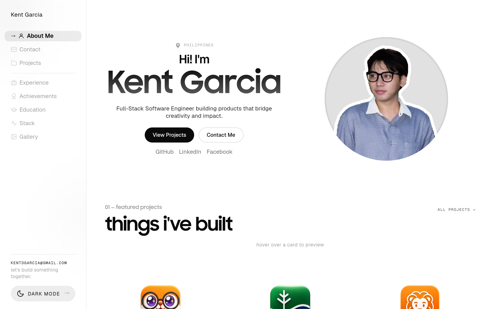

# kentgarcia Design System

You are building UI for **kentgarcia**. Light-themed, cool palette, monospace typography (MyFont), compact density on a 4px grid, expressive motion.

## Visual Reference

**IMPORTANT**: Study ALL screenshots below before writing any UI. Match colors, typography, spacing, layout, and motion exactly as shown.

### Homepage



> Read `references/DESIGN.md` for full token details.

## Design Philosophy

- **Layered depth** — use shadow tokens to create a sense of physical layering. Each elevation level has a specific shadow.
- **Gradient accents** — gradients are used thoughtfully for emphasis, not decoration.
- **Single typeface** — MyFont carries all text. Hierarchy comes from size, weight, and color — never font mixing.
- **compact density** — 4px base grid. Every dimension is a multiple of 4.
- **cool palette** — the color temperature runs cool, matching the monospace typography.
- **Restrained accent** — `#a78bfa` is the only pop of color. Used exclusively for CTAs, links, focus rings, and active states.
- **Expressive motion** — animations are an integral part of the experience. Use spring physics and layout animations.

## Color System

### Core Palette

| Role | Token | Hex | Use |
|------|-------|-----|-----|
| Background | `--background` | `#ffffff` | Page/app background |
| Surface | `--surface` | `#f4f4f5` | Cards, panels, modals |
| Text Primary | `--text-primary` | `#0a0a0a` | Headings, body text |
| Text Muted | `--text-muted` | `#a3a3a3` | Captions, placeholders |
| Accent | `--accent` | `#a78bfa` | CTAs, links, focus rings |
| Border | `--border` | `#2a2a30` | Dividers, card borders |

### Status Colors

| Status | Hex | Use |
|--------|-----|-----|
| Danger | `#fb923c` | Errors, destructive actions |

### Extended Palette

- `#000000` — Deep background layer or shadow color
- **border-subtle:** `#e9e9e9` — Secondary text, placeholder text
- **border-medium:** `#d4d4d4`
- **bg-secondary:** `#18181b` — Secondary text, placeholder text
- **border-medium:** `#3a3a42`
- `#222222`
- `#60a5fa`
- `#2563eb`

### CSS Variable Tokens

```css
--text-primary: #0a0a0a;
--text-secondary: #737373;
--text-muted: #a3a3a3;
--bg-primary: #ffffff;
--bg-secondary: #fafafa;
--border-subtle: #e9e9e9;
--border-medium: #d4d4d4;
--border-strong: rgba(10,10,10,.18);
--accent-primary: #0a0a0a;
--accent-primary-inverted: #ffffff;
--accent-secondary: rgba(10,10,10,.08);
--accent-muted: rgba(10,10,10,.04);
--shadow-card: 0 8px 22px rgba(0,0,0,.25);
--shadow-card-hover: 0 18px 36px rgba(0,0,0,.4);
--text-primary: #f4f4f5;
--text-secondary: #a0a0a8;
--text-muted: #8a8a92;
--bg-primary: #0c0c0f;
--bg-secondary: #18181b;
--border-subtle: #2a2a30;
```

## Typography

### Font Stack

- **MyFont** — Heading 1, Heading 2, Heading 3
- **Geist Mono** — Body, Caption, Code

### Font Sources

```css
@font-face {
  font-family: "MyFont";
  src: url("fonts/MyFont-Regular.woff2") format("woff2");
  font-weight: 400;
}
@font-face {
  font-family: "SamsungSharpSansBold";
  src: url("fonts/SamsungSharpSansBold-700.otf") format("opentype");
  font-weight: 700;
}
@font-face {
  font-family: "Geist";
  src: url("fonts/Geist-Bold.ttf") format("truetype");
  font-weight: 700;
}
@font-face {
  font-family: "Geist";
  src: url("fonts/Geist-Regular.ttf") format("truetype");
  font-weight: 400;
}
@font-face {
  font-family: "Geist Mono";
  src: url("fonts/GeistMono-Bold.ttf") format("truetype");
  font-weight: 700;
}
@font-face {
  font-family: "Geist Mono";
  src: url("fonts/GeistMono-Regular.ttf") format("truetype");
  font-weight: 400;
}
```

### Type Scale

| Role | Family | Size | Weight |
|------|--------|------|--------|
| Heading 1 | MyFont | clamp(6rem,22vw,20rem) | 700 |
| Heading 2 | MyFont | 3rem | 700 |
| Heading 3 | MyFont | clamp(3rem,6.2vw,5.2rem) | 700 |
| Body | Geist Mono | 1rem | 400 |
| Caption | Geist Mono | .85rem | 400 |
| Code | Geist Mono | 14px | 400 |

### Typography Rules

- All text uses **MyFont** — never add another font family
- Max 3-4 font sizes per screen
- Headings: weight 600-700, body: weight 400
- Use color and opacity for text hierarchy, not additional font sizes
- Line height: 1.5 for body, 1.2 for headings

## Spacing & Layout

### Base Grid: 4px

Every dimension (margin, padding, gap, width, height) must be a multiple of **4px**.

### Spacing Scale

`2, 4, 6, 8, 10, 12, 14, 16, 18, 20, 22, 24` px

### Spacing as Meaning

| Spacing | Use |
|---------|-----|
| 4-8px | Tight: related items (icon + label, avatar + name) |
| 12-16px | Medium: between groups within a section |
| 24-32px | Wide: between distinct sections |
| 48px+ | Vast: major page section breaks |

### Border Radius

Scale: `2px, 2.5px, 3px, 4px, 8px, 10px, 12px, 14px, 16px, 18px, 20px, 999px`
Default: `12px`

### Container

Max-width: `1023px`, centered with auto margins.

### Breakpoints

| Name | Value |
|------|-------|
| xs | 480px |
| sm | 600px |
| sm | 640px |
| md | 720px |
| md | 721px |
| lg | 900px |
| lg | 1023px |
| lg | 1024px |
| xl | 1100px |
| 2xl | 1440px |

Mobile-first: design for small screens, layer on responsive overrides.

## Component Patterns

### Card

```css
.card {
  background: #f4f4f5;
  border: 1px solid #2a2a30;
  border-radius: 12px;
  padding: 16px;
  box-shadow: var(--shadow-card);
}
```

```html
<div class="card">
  <h3>Card Title</h3>
  <p>Card content goes here.</p>
</div>
```

### Button

```css
/* Primary */
.btn-primary {
  background: #a78bfa;
  color: #0a0a0a;
  border-radius: 12px;
  padding: 8px 16px;
  font-weight: 500;
  transition: opacity 150ms ease;
}
.btn-primary:hover { opacity: 0.9; }

/* Ghost */
.btn-ghost {
  background: transparent;
  border: 1px solid #2a2a30;
  color: #0a0a0a;
  border-radius: 12px;
  padding: 8px 16px;
}
```

```html
<button class="btn-primary">Get Started</button>
<button class="btn-ghost">Learn More</button>
```

### Input

```css
.input {
  background: #ffffff;
  border: 1px solid #2a2a30;
  border-radius: 12px;
  padding: 8px 12px;
  color: #0a0a0a;
  font-size: 14px;
}
.input:focus { border-color: #a78bfa; outline: none; }
```

```html
<input class="input" type="text" placeholder="Search..." />
```

### Badge / Chip

```css
.badge {
  display: inline-flex;
  align-items: center;
  padding: 4px 8px;
  border-radius: 9999px;
  font-size: 12px;
  font-weight: 500;
  background: #f4f4f5;
  color: #a3a3a3;
}
```

```html
<span class="badge">New</span>
<span class="badge">Beta</span>
```

### Modal / Dialog

```css
.modal-backdrop { background: rgba(0, 0, 0, 0.6); }
.modal {
  background: #f4f4f5;
  border: 1px solid #2a2a30;
  border-radius: 999px;
  padding: 24px;
  max-width: 480px;
  width: 90vw;
  box-shadow: 0 3px 10px #00000040;
}
```

```html
<div class="modal-backdrop">
  <div class="modal">
    <h2>Dialog Title</h2>
    <p>Dialog content.</p>
    <button class="btn-primary">Confirm</button>
    <button class="btn-ghost">Cancel</button>
  </div>
</div>
```

### Table

```css
.table { width: 100%; border-collapse: collapse; }
.table th {
  text-align: left;
  padding: 8px 12px;
  font-weight: 500;
  font-size: 12px;
  color: #a3a3a3;
  text-transform: uppercase;
  letter-spacing: 0.05em;
  border-bottom: 1px solid #2a2a30;
}
.table td {
  padding: 12px;
  border-bottom: 1px solid #2a2a30;
}
```

```html
<table class="table">
  <thead><tr><th>Name</th><th>Status</th><th>Date</th></tr></thead>
  <tbody>
    <tr><td>Item One</td><td>Active</td><td>Jan 1</td></tr>
    <tr><td>Item Two</td><td>Pending</td><td>Jan 2</td></tr>
  </tbody>
</table>
```

### Navigation

```css
.nav {
  display: flex;
  align-items: center;
  gap: 8px;
  padding: 12px 16px;
  border-bottom: 1px solid #2a2a30;
}
.nav-link {
  color: #a3a3a3;
  padding: 8px 12px;
  border-radius: 12px;
  transition: color 150ms;
}
.nav-link:hover { color: #0a0a0a; }
.nav-link.active { color: #a78bfa; }
```

```html
<nav class="nav">
  <a href="/" class="nav-link active">Home</a>
  <a href="/about" class="nav-link">About</a>
  <a href="/pricing" class="nav-link">Pricing</a>
  <button class="btn-primary" style="margin-left: auto">Get Started</button>
</nav>
```

## Animation & Motion

This project uses **expressive motion**. Animations are part of the design language.

### CSS Animations

- `sidebar-orb-drift`
- `github-pulse`
- `featuredPopupIn`
- `scrapbook-sparkle`
- `footer-gradient-move`

### Motion Tokens

- **Duration scale:** `0ms`, `50ms`, `100ms`, `180ms`, `200ms`, `220ms`, `240ms`, `260ms`, `280ms`, `300ms`, `320ms`, `350ms`, `360ms`, `400ms`, `450ms`, `500ms`, `520ms`, `600ms`, `700ms`
- **Easing functions:** `ease`, `cubic-bezier(.22,1,.36,1)`, `cubic-bezier(.34,1.56,.64,1)`
- **Animated properties:** `opacity`

### Motion Guidelines

- **Duration:** Use values from the duration scale above. Short (0ms) for micro-interactions, long (700ms) for page transitions
- **Easing:** Use `ease` as the default easing curve
- **Direction:** Elements enter from bottom/right, exit to top/left
- **Reduced motion:** Always respect `prefers-reduced-motion` — disable animations when set

## Depth & Elevation

### Shadow Tokens

- Raised (cards, buttons): `var(--shadow-card)`
- Raised (cards, buttons): `var(--shadow-gallery)`
- Raised (cards, buttons): `var(--shadow-gallery-hover)`
- Raised (cards, buttons): `0 2px 8px #0000000a`
- Raised (cards, buttons): `var(--shadow-modal)`
- Floating (dropdowns, popovers): `0 3px 10px #00000040`

### Z-Index Scale

`0, 1, 2, 3, 4, 5, 10, 11, 12, 20, 30, 40, 50, 140, 300`

Use these exact values — never invent z-index values.

## Anti-Patterns (Never Do)

- **No blur effects** — no backdrop-blur, no filter: blur()
- **No zebra striping** — tables and lists use borders for separation
- **No invented colors** — every hex value must come from the palette above
- **No arbitrary spacing** — every dimension is a multiple of 4px
- **No extra fonts** — only MyFont and Geist Mono are allowed
- **No arbitrary border-radius** — use the scale: 2px, 2.5px, 3px, 4px, 8px, 10px, 12px, 14px, 16px, 18px
- **No opacity for disabled states** — use muted colors instead

## Workflow

1. **Read** `references/DESIGN.md` before writing any UI code
2. **Pick colors** from the Color System section — never invent new ones
3. **Set typography** — MyFont, Geist Mono only, using the type scale
4. **Build layout** on the 4px grid — check every margin, padding, gap
5. **Match components** to patterns above before creating new ones
6. **Apply elevation** — use shadow tokens
7. **Validate** — every value traces back to a design token. No magic numbers.

## Brand Spec

- **Favicon:** `/favicon.svg`
- **Site URL:** `https://www.kentgarcia.me/`
- **Brand color:** `#a78bfa`
- **Brand typeface:** MyFont

## Quick Reference

```
Background:     #ffffff
Surface:        #f4f4f5
Text:           #0a0a0a / #a3a3a3
Accent:         #a78bfa
Border:         #2a2a30
Font:           MyFont
Spacing:        4px grid
Radius:         12px
Components:     0 detected
```

## When to Trigger

Activate this skill when:
- Creating new components, pages, or visual elements for kentgarcia
- Writing CSS, Tailwind classes, styled-components, or inline styles
- Building page layouts, templates, or responsive designs
- Reviewing UI code for design consistency
- The user mentions "kentgarcia" design, style, UI, or theme
- Generating mockups, wireframes, or visual prototypes

---

# Full Reference Files

> Every output file is embedded below. Claude has full design system context from /skills alone.

## Design System Tokens (DESIGN.md)

# kentgarcia DESIGN.md

> Auto-generated design system — reverse-engineered via static analysis by skillui.
> Frameworks: None detected
> Colors: 18 · Fonts: 2 · Components: 0
> Icon library: not detected · State: not detected
> Primary theme: light · Dark mode toggle: no · Motion: expressive

## Visual Reference

**Match this design exactly** — study colors, fonts, spacing, and component shapes before writing any UI code.


---

## 1. Visual Theme & Atmosphere

This is a **light-themed** interface with a cool, approachable feel. The light background emphasizes content clarity. Typography uses **MyFont** throughout — a technical, developer-focused choice that maintains consistency. Spacing follows a **4px base grid** (compact density), with scale: 2, 4, 6, 8, 10, 12, 14, 16px. The palette is predominantly monochromatic with **#a78bfa** as the single accent color — used sparingly for interactive elements and emphasis. Motion is expressive — spring physics, layout animations, and staggered reveals are part of the visual language.

---

## 2. Color Palette & Roles

| Token | Hex | Role | Use |
|---|---|---|---|
| text-inverted | `#ffffff` | background | Page background, darkest surface |
| text-primary | `#f4f4f5` | surface | Card and panel backgrounds |
| text-primary | `#0a0a0a` | text-primary | Headings and body text |
| text-muted | `#a3a3a3` | text-muted | Captions, placeholders, secondary info |
| text-secondary | `#737373` | text-muted | Captions, placeholders, secondary info |
| text-muted | `#8a8a92` | text-muted | Captions, placeholders, secondary info |
| border-subtle | `#2a2a30` | border | Dividers, card borders, outlines |
| accent | `#a78bfa` | accent | CTAs, links, focus rings, active states |
| danger | `#fb923c` | danger | Error states, destructive actions |
| info | `#60a5fa` | info | Informational highlights |
| unknown | `#000000` | unknown | Palette color |
| border-subtle | `#e9e9e9` | unknown | Palette color |
| border-medium | `#d4d4d4` | unknown | Palette color |
| bg-secondary | `#18181b` | unknown | Palette color |
| border-medium | `#3a3a42` | unknown | Palette color |
| unknown | `#222222` | unknown | Palette color |
| unknown | `#2563eb` | unknown | Palette color |
| unknown | `#f472b6` | unknown | Palette color |

### CSS Variable Tokens

```css
--text-primary: #0a0a0a;
--text-secondary: #737373;
--text-muted: #a3a3a3;
--bg-primary: #ffffff;
--bg-secondary: #fafafa;
--border-subtle: #e9e9e9;
--border-medium: #d4d4d4;
--border-strong: rgba(10,10,10,.18);
--accent-primary: #0a0a0a;
--accent-primary-inverted: #ffffff;
--accent-secondary: rgba(10,10,10,.08);
--accent-muted: rgba(10,10,10,.04);
--shadow-card: 0 8px 22px rgba(0,0,0,.25);
--shadow-card-hover: 0 18px 36px rgba(0,0,0,.4);
--text-primary: #f4f4f5;
--text-secondary: #a0a0a8;
--text-muted: #8a8a92;
--bg-primary: #0c0c0f;
--bg-secondary: #18181b;
--border-subtle: #2a2a30;
```


---

## 3. Typography Rules

**Font Stack:**
- **MyFont** — Heading 1, Heading 2, Heading 3
- **Geist Mono** — Body, Caption, Code

**Font Sources:**

```css
@font-face {
  font-family: "MyFont";
  src: url("fonts/MyFont-Regular.woff2") format("woff2");
  font-weight: 400;
}
@font-face {
  font-family: "SamsungSharpSansBold";
  src: url("fonts/SamsungSharpSansBold-700.otf") format("opentype");
  font-weight: 700;
}
@font-face {
  font-family: "Geist";
  src: url("fonts/Geist-Bold.ttf") format("truetype");
  font-weight: 700;
}
@font-face {
  font-family: "Geist";
  src: url("fonts/Geist-Regular.ttf") format("truetype");
  font-weight: 400;
}
@font-face {
  font-family: "Geist Mono";
  src: url("fonts/GeistMono-Bold.ttf") format("truetype");
  font-weight: 700;
}
@font-face {
  font-family: "Geist Mono";
  src: url("fonts/GeistMono-Regular.ttf") format("truetype");
  font-weight: 400;
}
```

| Role | Font | Size | Weight |
|---|---|---|---|
| Heading 1 | MyFont | clamp(6rem,22vw,20rem) | 700 |
| Heading 2 | MyFont | 3rem | 700 |
| Heading 3 | MyFont | clamp(3rem,6.2vw,5.2rem) | 700 |
| Body | Geist Mono | 1rem | 400 |
| Caption | Geist Mono | .85rem | 400 |
| Code | Geist Mono | 14px | 400 |

**Typographic Rules:**
- Use **MyFont** for all text — do not mix font families
- Maintain consistent hierarchy: no more than 3-4 font sizes per screen
- Headings use bold (600-700), body uses regular (400)
- Line height: 1.5 for body text, 1.2 for headings
- Use color and opacity for secondary hierarchy, not additional font sizes


---

## 4. Component Stylings

No components detected. Scan `src/components/` or `components/` to populate this section.

---

## 5. Layout Principles

- **Base spacing unit:** 4px
- **Spacing scale:** 2, 4, 6, 8, 10, 12, 14, 16, 18, 20, 22, 24
- **Border radius:** 2px, 2.5px, 3px, 4px, 8px, 10px, 12px, 14px, 16px, 18px, 20px, 999px
- **Max content width:** 1023px

**Spacing as Meaning:**
| Spacing | Use |
|---|---|
| 4-8px | Tight: related items within a group |
| 12-16px | Medium: between groups |
| 24-32px | Wide: between sections |
| 48px+ | Vast: major section breaks |


---

## 6. Depth & Elevation

### Raised — cards, buttons, interactive elements

- `var(--shadow-card)`
- `var(--shadow-gallery)`
- `var(--shadow-gallery-hover)`

### Floating — dropdowns, popovers, modals

- `0 3px 10px #00000040`

### Overlay — full-screen overlays, top-level dialogs

- `0 32px 80px #00000080`
- `0 16px 32px #0000001f`

### Z-Index Scale

`0, 1, 2, 3, 4, 5, 10, 11, 12, 20, 30, 40, 50, 140, 300`


---

## 7. Animation & Motion

This project uses **expressive motion**. Animations are an integral part of the experience.

### CSS Animations

- `@keyframes sidebar-orb-drift`
- `@keyframes github-pulse`
- `@keyframes featuredPopupIn`
- `@keyframes scrapbook-sparkle`
- `@keyframes footer-gradient-move`

### Motion Guidelines

- Duration: 150-300ms for micro-interactions, 300-500ms for page transitions
- Easing: `ease-out` for enters, `ease-in` for exits
- Always respect `prefers-reduced-motion`


---

## 8. Do's and Don'ts

### Do's

- Use `#a78bfa` for interactive elements (buttons, links, focus rings)
- Use `#ffffff` as the primary page background
- Use **MyFont** for all UI text
- Follow the **4px** spacing grid for all margins, padding, and gaps
- Use the defined shadow tokens for elevation — see Section 6
- Use border-radius from the scale: 2px, 2.5px, 3px, 4px, 8px

### Don'ts

- Don't introduce colors outside this palette — extend the design tokens first
- Don't mix font families — use MyFont consistently
- Don't use arbitrary spacing values — stick to multiples of 4px
- Don't create custom box-shadow values outside the system tokens
- Don't use arbitrary border-radius values — pick from the defined scale
- Don't use backdrop-blur or blur effects

### Anti-Patterns (detected from codebase)

- No blur or backdrop-blur effects
- No zebra striping on tables/lists


---

## 9. Responsive Behavior

| Name | Value | Source |
|---|---|---|
| xs | 480px | css |
| sm | 600px | css |
| sm | 640px | css |
| md | 720px | css |
| md | 721px | css |
| lg | 900px | css |
| lg | 1023px | css |
| lg | 1024px | css |
| xl | 1100px | css |
| 2xl | 1440px | css |

**Approach:** Use `@media (min-width: ...)` queries matching the breakpoints above.


---

## 10. Agent Prompt Guide

Use these as starting points when building new UI:

### Build a Card

```
Background: #f4f4f5
Border: 1px solid #2a2a30
Radius: 12px
Padding: 16px
Font: MyFont
Use shadow tokens from Section 6.
```

### Build a Button

```
Primary: bg #a78bfa, text white
Ghost: bg transparent, border #2a2a30
Padding: 8px 16px
Radius: 12px
Hover: opacity 0.9 or lighter shade
Focus: ring with #a78bfa
```

### Build a Page Layout

```
Background: #ffffff
Max-width: 1023px, centered
Grid: 4px base
Responsive: mobile-first, breakpoints from Section 9
```

### Build a Stats Card

```
Surface: #f4f4f5
Label: #a3a3a3 (muted, 12px, uppercase)
Value: #0a0a0a (primary, 24-32px, bold)
Status: use success/warning/danger from Section 2
```

### Build a Form

```
Input bg: #ffffff
Input border: 1px solid #2a2a30
Focus: border-color #a78bfa
Label: #a3a3a3 12px
Spacing: 16px between fields
Radius: 12px
```

### General Component

```
1. Read DESIGN.md Sections 2-6 for tokens
2. Colors: only from palette
3. Font: MyFont, type scale from Section 3
4. Spacing: 4px grid
5. Components: match patterns from Section 4
6. Elevation: shadow tokens
```

## Bundled Fonts (fonts/)

The following font files are bundled in the `fonts/` directory:

- `fonts/._Geist-Black.ttf`
- `fonts/._Geist-Bold.ttf`
- `fonts/._Geist-ExtraBold.ttf`
- `fonts/._Geist-ExtraLight.ttf`
- `fonts/._Geist-Light.ttf`
- `fonts/._Geist-Medium.ttf`
- `fonts/._Geist-Regular.ttf`
- `fonts/._Geist-SemiBold.ttf`
- `fonts/._Geist-Thin.ttf`
- `fonts/._GeistMono-Black.ttf`
- `fonts/._GeistMono-Bold.ttf`
- `fonts/._GeistMono-ExtraBold.ttf`
- `fonts/._GeistMono-ExtraLight.ttf`
- `fonts/._GeistMono-Light.ttf`
- `fonts/._GeistMono-Medium.ttf`
- `fonts/._GeistMono-Regular.ttf`
- `fonts/._GeistMono-SemiBold.ttf`
- `fonts/._GeistMono-Thin.ttf`
- `fonts/._MyFont-Regular.woff2`
- `fonts/._SamsungSharpSansBold-700.otf`
- `fonts/Geist-Black.ttf`
- `fonts/Geist-Bold.ttf`
- `fonts/Geist-ExtraBold.ttf`
- `fonts/Geist-ExtraLight.ttf`
- `fonts/Geist-Light.ttf`
- `fonts/Geist-Medium.ttf`
- `fonts/Geist-Regular.ttf`
- `fonts/Geist-SemiBold.ttf`
- `fonts/Geist-Thin.ttf`
- `fonts/GeistMono-Black.ttf`
- `fonts/GeistMono-Bold.ttf`
- `fonts/GeistMono-ExtraBold.ttf`
- `fonts/GeistMono-ExtraLight.ttf`
- `fonts/GeistMono-Light.ttf`
- `fonts/GeistMono-Medium.ttf`
- `fonts/GeistMono-Regular.ttf`
- `fonts/GeistMono-SemiBold.ttf`
- `fonts/GeistMono-Thin.ttf`
- `fonts/MyFont-Regular.woff2`
- `fonts/SamsungSharpSansBold-700.otf`

Use these local font files in `@font-face` declarations instead of fetching from Google Fonts.

## Homepage Screenshots (screenshots/)


